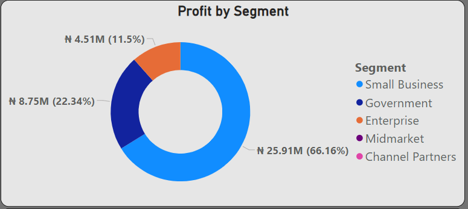
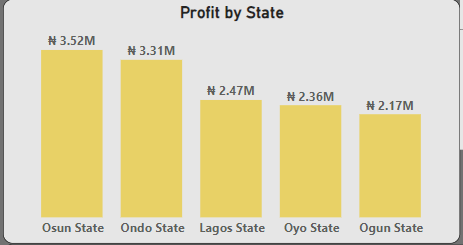
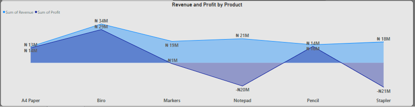
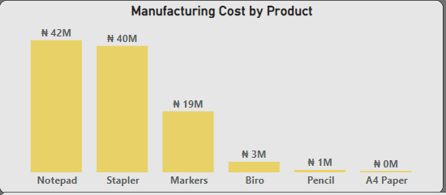

# Jim Merchandise Sales Analysis

## Overview
**_Jim merchandise_** is a business outfit that supplies stationeries to various market segments. The objective of this data analysis project is to identify the market segment, state, as well as product category that offers profit prospects for the business. This is geared towards streamlining the business for profit.

## Source of Data
The dataset used for this analysis was gotten from the Excel sheet containing the sales records

## Tools Used
- Microsoft Excel
- Microsoft Power BI
- Power Query
 
Based on the findings from the data analysis project for Jim Merchandise, here are detailed insights and strategic recommendations:

# Key Findings
## Market Segment Analysis:

**Most Profitable Segment:** Small businesses are the most profitable market segment.

**Highest Revenue Segment:** Supplies to the government generated the most revenue.

## State Analysis:

**Profitability:** The business made a profit across all states.

## Product Category Analysis:

**Profitable Products:** Biro, pencils, and A4 paper were profitable.  

**Loss-Making Products:** Notepads and staplers resulted in substantial losses due to high production costs.

# Recommendations

## Market Segment Strategy

### Focus on Small Businesses:

**Marketing Campaigns:** Develop targeted marketing campaigns to attract more small business customers.
Product Bundles: Create tailored product bundles or subscription services for small businesses to encourage repeat purchases.
Optimize Government Contracts:

### Profit Analysis:
Analyze the profitability of government contracts to understand the cost structure.
**Negotiation:** Negotiate better terms or adjust pricing strategies to increase the profitability of government supplies.

## State Strategy

### Maintain Broad Distribution:

**Optimization:** Continue to optimize the distribution network to ensure profitability across all states.

**Focus on High-Profit States:** Increase marketing efforts in states with the highest profit margins.

## Product Category Strategy

### Enhance Profitable Products:

**Inventory and Marketing:** Increase inventory and marketing efforts for biro, pencils, and A4 paper to maximize sales and profitability.
**Bundling:** Consider bundling these profitable products with other items to boost overall sales.

### Address Loss-Making Products:

**Notepads:**

- Cost Structure Review: Review and optimize the cost structure, including production, procurement, and pricing.
- Cost Reduction: Explore ways to reduce production costs or consider discontinuing the product if it cannot be made profitable.

**Staplers:**
- Loss Analysis: Assess the reasons for the losses, such as high costs, low demand, or strong competition.
- Action Plan: Take corrective actions such as renegotiating supplier contracts, improving product differentiation, or discontinuing the product.

  ## Operational Improvements

### Cost Efficiency:

- Cost Monitoring: Continuously monitor and optimize operational costs across all areas, including procurement, production, and distribution.
- Cost-Saving Measures: Implement cost-saving measures where possible without compromising product quality or customer service.

### Data-Driven Decisions:

- Regular Reviews: Utilize data analytics to regularly review market trends, customer preferences, and product performance.
Informed Decisions: Make informed decisions based on data insights to adapt strategies and remain competitive.

## Implementation Plan

### Action Steps:

- Marketing: Develop and execute marketing campaigns targeting small businesses.
- Contract Optimization: Optimize pricing and terms for government contracts.
- Product Focus: Increase focus on profitable products and address issues with loss-making products.

## Resource Allocation:

- Budgeting: Allocate budget and resources towards high-potential market segments and products.
- Data Analytics: Invest in data analytics tools and personnel to enhance decision-making processes.

## Monitoring and Evaluation:

- Performance Tracking: Set up a system to track the performance of implemented strategies.
- Regular Reviews: Regularly review financial data and market conditions to adjust strategies as needed.
_**By focusing on the most profitable market segments, optimizing product offerings, and ensuring cost efficiency, Jim Merchandise can enhance its profitability and streamline its business operations**_ 
